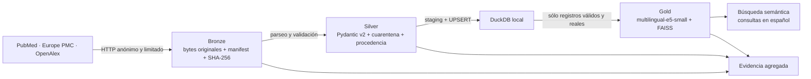

# baby-first-steps-medallion

[](https://github.com/GabrielaPichardo97/BBFS/actions/workflows/ci.yml)
[](https://github.com/GabrielaPichardo97/BBFS/actions/workflows/e2e-live.yml)
[](https://www.python.org/downloads/release/python-3110/)
[](LICENSE)

Arquitectura medallón local, gratuita y dockerizada para recuperar, validar e
indexar metadatos y resúmenes públicos sobre juego y desarrollo infantil
temprano. El rango predeterminado es **0 a 36 meses**. El corpus puede contener
documentos en español o inglés, pero la búsqueda semántica, sus ejemplos y la
demostración funcional aceptan consultas **únicamente en español**.

El producto ofrece recuperación documental. No proporciona diagnóstico,
tratamiento, prescripción, consejo médico personalizado ni una certificación de
seguridad de juguetes o actividades.

## Fuentes y alcance

| Fuente | Uso inicial | Formato Bronze | Identificadores |
| --- | --- | --- | --- |
| PubMed E-utilities | Evidencia biomédica | JSON de búsqueda y XML de registros | PMID, DOI |
| Europe PMC REST | Metadatos y resúmenes biomédicos complementarios | JSON | PMID/PMCID, DOI, ID nativo |
| OpenAlex REST | Cobertura académica multilingüe | JSON | OpenAlex ID, DOI |

La ingesta usa consultas internas españolas e inglesas para mejorar el recall.
No descarga PDFs, imágenes ni texto completo, y no usa scraping, API keys o
servicios pagados. SciELO permanece fuera del camino crítico hasta disponer de
un endpoint público estable y documentado.

## Arquitectura



- **Bronze** conserva cada `response.content` byte a byte. El manifest separado
  registra fuente, consulta, URL, fecha, estado, tamaño y SHA-256.
- **Silver** verifica hashes, extrae por fuente, valida con Pydantic v2,
  normaliza DOI/PMID, deduplica con reglas deterministas y conserva cuarentena y
  procedencia. DuckDB recibe staging y UPSERT transaccional.
- **Gold** codifica únicamente documentos Silver válidos con
  `intfloat/multilingual-e5-small` en CPU. FAISS es incremental y local.

## Quickstart local

Requiere Python 3.11. Las versiones directas y transitivas están fijadas en
`requirements.lock`.

```powershell
py -3.11 -m venv .venv
.\.venv\Scripts\Activate.ps1
python -m pip install --requirement requirements.lock
python -m pip install --no-deps --no-build-isolation --editable .
baby-first-steps doctor
```

Una ingesta real pequeña:

```powershell
baby-first-steps ingest --sources pubmed,europe_pmc,openalex --profiles motor_sensory --max-records-per-source 5
baby-first-steps silver --batch-id <batch_id>
baby-first-steps gold
baby-first-steps search "actividades sensoriales con diferentes texturas para un bebé" --top-k 5
```

La primera ejecución de Gold descarga el modelo público a una caché ignorada
por Git. Los payloads reales, DuckDB, modelos e índices nunca se versionan.

## Docker

El único servicio se llama `pipeline`, usa Python 3.11 y se ejecuta con el
usuario no root `10001`. No incluye CUDA ni requiere GPU.

```powershell
docker compose config
docker compose build
docker compose run --rm pipeline doctor
docker compose run --rm pipeline demo --fresh --yes
docker compose run --rm pipeline evidence
docker compose run --rm pipeline search "lectura compartida para estimular el lenguaje" --top-k 5
```

`./data` y `./artifacts` son persistentes; la caché de Hugging Face usa un
volumen independiente.

## Idempotencia, cuarentena y sintéticos

Silver calcula `rows_inserted`, `rows_updated` y `rows_noop` antes del UPSERT.
Reprocesar el mismo batch no crea entidades, procedencias ni cuarentenas
duplicadas. Gold compara `content_hash`, modelo y revisión: un documento sin
cambios no vuelve a generar su embedding ni reescribe el índice.

Los registros reales inválidos se conservan en `silver_rejects` con un
`quarantine_id` determinista, locator Bronze, hash y todos los motivos de
rechazo. Los datos sintéticos sólo existen bajo `tests/fixtures/synthetic/` y
las pruebas verifican que `source_type='synthetic'` no alcance Bronze, Silver,
Gold ni evidencia productiva.

## Demostración y evidencia

```powershell
baby-first-steps demo --fresh
# Para automatización no interactiva:
baby-first-steps demo --fresh --yes
```

El comando crea dos batches reales, procesa explícitamente el primero, lo
reprocesa sin volver a llamar las APIs, ejecuta auditorías de duplicados, seis
búsquedas en español y la salvaguarda sintética. Cualquier criterio fallido
produce un código de salida distinto de cero.

Las salidas locales ignoradas por Git son:

- `artifacts/evidence.json`;
- `artifacts/evidence.csv`;
- `artifacts/run.log`;
- `docs/evidence.generated.md`.

La CI rápida se ejecuta en pull requests y pushes a `main` sin llamadas live.
El workflow `E2E live` sólo se ejecuta manualmente o una vez por semana; publica
durante 14 días evidencia, manifests y checksums mediante una lista explícita.
No publica respuestas Bronze completas.

## Pruebas

```powershell
python -m ruff check src tests scripts/check_repository_hygiene.py
python -m mypy src
python -m coverage run --source=baby_first_steps_medallion -m pytest tests/unit
python -m coverage report --show-missing
pytest tests/integration -m integration
python scripts/check_repository_hygiene.py --root . --mode publishable
```

La integración offline recorre un batch vacío válido, usa directorios
temporales y bloquea conexiones de red. Las pruebas unitarias de Gold sustituyen
el modelo por vectores deterministas. Nunca se presentan fixtures sintéticos
como evidencia real ni se cargan en Silver o Gold.

## Limitaciones y documentación

- La disponibilidad y los límites de las APIs externas pueden cambiar.
- PubMed y Europe PMC se solapan; la procedencia se conserva y la entidad
  canónica se deduplica por DOI/PMID, nunca por título.
- La presencia de un resultado no demuestra eficacia clínica, pertinencia para
  una edad concreta ni seguridad material.
- Los abstracts pueden estar protegidos por sus autores o editoriales; por eso
  no se versionan respuestas completas ni se publican como artifacts de CI.
- La búsqueda multilingüe ordena similitud semántica, no validez médica.

Documentación detallada:

- [Guía de ejecución](docs/execution-guide.md)
- [Trazabilidad de la rúbrica](docs/rubric-traceability.md)
- [Limitaciones](docs/limitations.md)
- [Seguridad y privacidad](docs/security-and-privacy.md)
- [Fuentes y licencias](docs/source-licenses.md)
- [Contrato de datos](docs/data-contract.md)
- [Arquitectura](docs/architecture.md)

El código del repositorio se distribuye bajo licencia [MIT](LICENSE). Los
metadatos y resúmenes recuperados conservan los derechos y condiciones de sus
fuentes originales.
